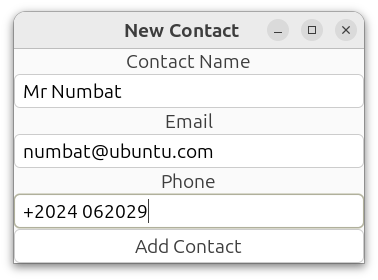
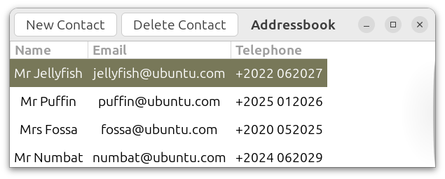

# GTK4 Programming in C

Source code for the series of articles entitled "GTK4 programming in C" in Full Circle Magazine. 

[Full Circle Magazine](https://fullcirclemagazine.org/)

* Article 1: Getting Started 
* Article 2: Developing a simple alarm clock application
* Article 3: GObject (creating the PersonContact class)
* Article 4: Address book using fictitious individuals, Mr Jellyfish, Mr Puffin, Mrs Fossa and Mr Numbat named after Ubuntu releases.

### New Contact

### Address Book Application

